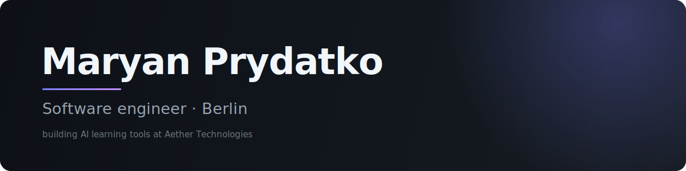

  

  

 

I'm a software engineering student in Berlin, working as a student developer at
**Aether Technologies UG**. I care more about building useful tools than chasing shiny
ones, and I like owning things end-to-end. Outside of product work I follow my
curiosity — lately into quantum computing and a student art initiative.

#### Now

Helping build **[Hivemind](https://gethivemind.app/)** — an AI learning app — and
**Brainjuice**, short-form video learning launching soon. Studying B.Sc. Software
Engineering at **CODE University of Applied Sciences**, Berlin.

#### Selected work

- **[self-learning-ai-agent](https://github.com/MaryanPrydatko/self-learning-ai-agent)** — an autonomous agent built for the Zauber challenge at Big Berlin Hack
- **[pathfinder-java](https://github.com/MaryanPrydatko/pathfinder-java)** — a JavaFX visualizer for A\*, Dijkstra, BFS and DFS, with maze generation and live animation
- **[HOME / HOMELAND](https://github.com/MaryanPrydatko/art-gallery)** — the website for an international student art initiative I help organize at Sigmund Freud University Berlin, with partners in São Paulo and Sulaimania
- **[HausPet](https://github.com/MaryanPrydatko/HausPetApp)** — an AI pet-health app (React Native + Expo) with a bilingual [landing page](https://github.com/MaryanPrydatko/HausPet-landing) for a smart collar
- **[sladent-website](https://github.com/MaryanPrydatko/sladent-website)** — a website for a dentistry practice

#### Stack

`TypeScript` · `Python` · `Java` · `React Native` · `Hono` · `PostgreSQL` · `Docker`

 

Open to interesting problems and good people to build with.

